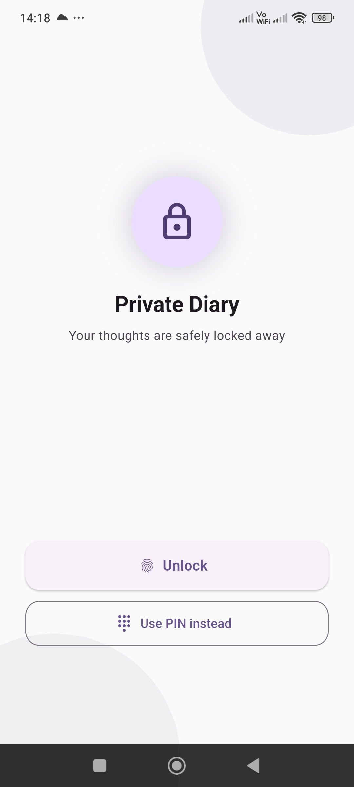
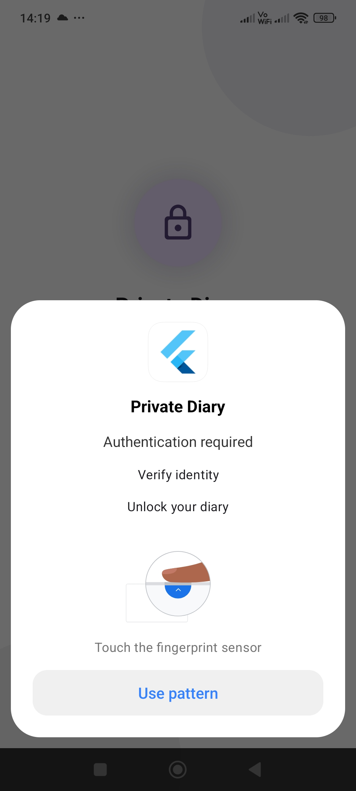
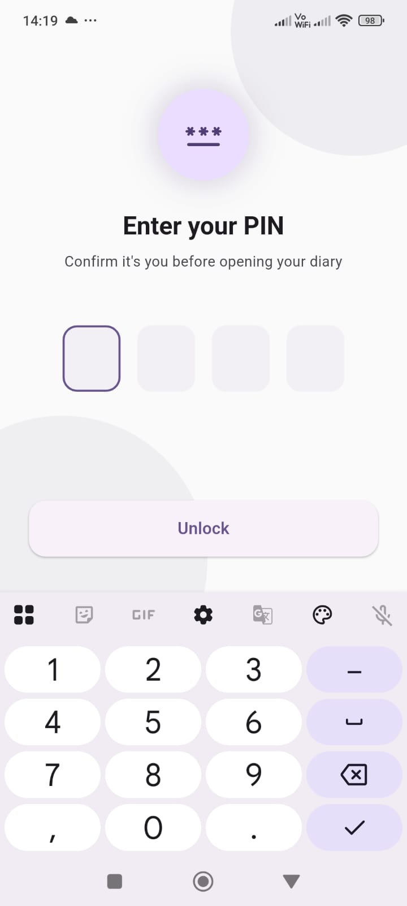
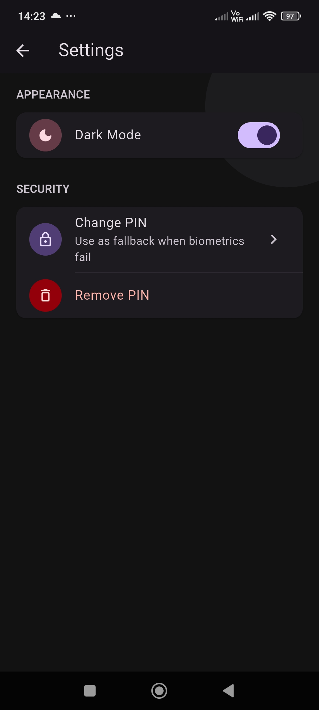

# Private Diary

A biometric-locked personal diary app built with Flutter. Your thoughts, completely private — secured by your fingerprint or Face ID.

> Built in public in 2 weeks as an open-source side project.

---

##  Screenshots

| Lock | Finger Print | Pin | Home |
|------|-------|-------|----------|
|  |  |  |  |

| Write | Stats | Settings (Light) | Settings (Dark) |
|------|-------|-------|----------|
|  |  |  |  |

---

##  Features

- 🔐 Biometric lock (fingerprint / Face ID)
- 🔑 4-digit PIN fallback
- 📝 Write, edit, and delete diary entries
- 😊 Mood tracker with 5 moods
- 📊 Mood stats with pie chart
- 🔥 Writing streak counter
- 🔍 Search entries by keyword
- 🌙 Light / dark mode with persistence
- 💾 100% local storage — no cloud, no account

---

## 🛠️ Tech Stack

- Flutter
- Provider (state management)
- Hive (local database)
- local_auth (biometric authentication)
- flutter_secure_storage (PIN storage)
- fl_chart (mood chart)
- shared_preferences (theme change)

---

## 🚀 Getting Started

1. Clone the repo
```bash
   git clone https://github.com/nouman-6/private_diary.git
   cd private_diary
```

2. Install dependencies
```bash
   flutter pub get
```

3. Run the app
```bash
   flutter run
```

> **Note:** Biometric auth requires a real device with fingerprint or Face ID enrolled. Make sure `minSdkVersion` is set to 23 in `android/app/build.gradle`.

---

## 📁 Project Structure

lib/

├── data/          # Repositories (Hive, PIN)

├── model/         # DiaryEntry Hive model

├── provider/      # DiaryProvider, ThemeProvider

├── theme/         # Light & dark theme definitions

└── view/          # All screens

---

## 🤝 Contributing

Contributions are welcome! Here's how:

1. Fork the repo
2. Create a branch (`git checkout -b feature/your-feature`)
3. Commit your changes (`git commit -m 'Add your feature'`)
4. Push to the branch (`git push origin feature/your-feature`)
5. Open a Pull Request

Please open an issue first for major changes.

---

## 📄 License

MIT License — see [LICENSE](LICENSE) for details.

---

## 👨‍💻 Author

Built by [Your Name](https://github.com/yourusername) as a build-in-public project.

Follow the journey on [LinkedIn](#) • [X/Twitter](#)
