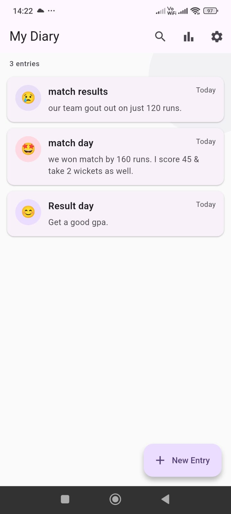
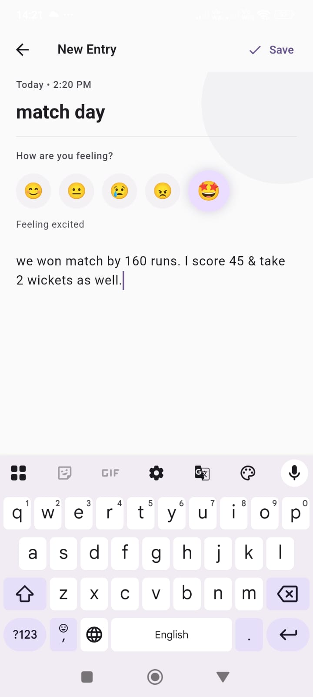
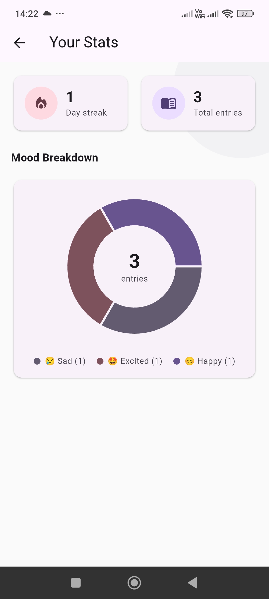
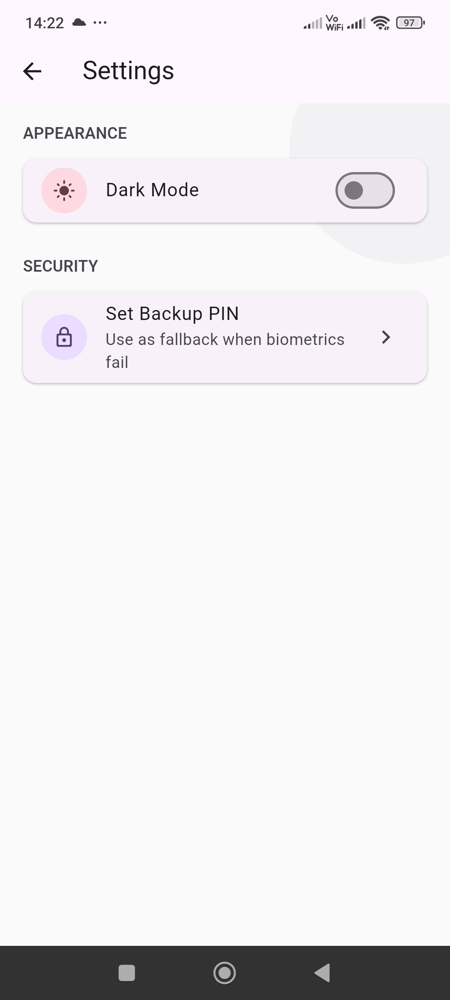

# Private Diary

A biometric-locked personal diary app built with Flutter. Your thoughts, completely private — secured by your fingerprint or Face ID.

> Built in public in 2 weeks as an open-source side project.

---

##  Screenshots

| Home | Write | Stats | Settings |
|------|-------|-------|----------|
|  |  |  |  |

| Home | Write | Stats | Settings |
|------|-------|-------|----------|
|  |  |  |  |

---

##  Features

- 🔐 Biometric lock (fingerprint / Face ID)
- 🔑 4-digit PIN fallback
- 📝 Write, edit, and delete diary entries
- 😊 Mood tracker with 5 moods
- 📊 Mood stats with pie chart
- 🔥 Writing streak counter
- 🔍 Search entries by keyword
- 🌙 Light / dark mode with persistence
- 💾 100% local storage — no cloud, no account

---

## 🛠️ Tech Stack

- Flutter
- Provider (state management)
- Hive (local database)
- local_auth (biometric authentication)
- flutter_secure_storage (PIN storage)
- fl_chart (mood chart)

---

## 🚀 Getting Started

1. Clone the repo
```bash
   git clone https://github.com/yourusername/private_diary.git
   cd private_diary
```

2. Install dependencies
```bash
   flutter pub get
```

3. Run the app
```bash
   flutter run
```

> **Note:** Biometric auth requires a real device with fingerprint or Face ID enrolled. Make sure `minSdkVersion` is set to 23 in `android/app/build.gradle`.

---

## 📁 Project Structure
